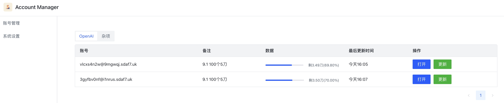

<p align="center">
  <a href="https://github.com/zscorpio/account-manager"></a>
</p>

<div align="center">

# Account Manager

_✨ 多账号隔离管理浏览器, 多平台电商从业者福音 ✨_

</div>

<p align="center">
  <a href="https://raw.githubusercontent.com/zscorpio/account-manager/main/LICENSE">
    
  </a>
  <a href="https://github.com/zscorpio/account-manager/releases/latest">
    
  </a>
  <a href="https://github.com/zscorpio/account-manager/releases/latest">
    
  </a>
</p>

> **Note**
> 因为个人需求, 所以本身是想做个OpenAI余额管理器的, 之前也写了一个[OpenAI余额管理工具](https://github.com/zscorpio/openai-tool), 主要是因为之前那些方案基本上都不可用了, 目前github上开源的方案呢, 基本上都是需要提供账号密码到三方搭建的网站去模拟登录获取验证信息, 相对来说还是较为不安全的, 但是之前那个方案跑起来比较麻烦, 所以考虑还是做个客户端, 顺便练练手.
>
> 之前刚好也有一个朋友需要管理大量的第三方的电商平台账号, 淘宝, 拼多多, 京东等一共几十个账号, 每次来回切换登录极其麻烦. 我自己本身在公司也经常会有这种测试需求, 需要来回切换账号, 查看功能是否正常.
> 
> 另外总会有些奇奇怪怪的网站你希望用隐私模式访问, 因为普通模式会同步浏览器访问记录, 地址栏会自动补全, 但是不登陆的话, 会缺少一些自定义的推荐, 每次登录又很麻烦.
> 
> 所以我在实现OpenAI相关余额的管理之后,做了一个通用的账号切换管理. 

## 功能
1. 支持多账号浏览器隔离管理.
2. 支持自定义数据目录
3. 支持自定义浏览器.

## 安装
1. 从 [GitHub Releases](https://github.com/zscorpio/account-manager/releases/latest) 下载可执行文件或者从源码编译：
   ```shell
   git clone git@github.com:zscorpio/account-manager.git
   
   # 构建
   cd account-manager
   npm install
    
   # build
   npm run build:mac
   npm run build:win
   npm run build:linux
   
## 配置
系统本身下载即用, 同时你也可以修改一些配置来优化使用体验.


1. 你可以自定义数据目录, 方便迁移和编辑配置.
2. 默认自带的浏览器是Puppeteer和Chrome会稍微有点区别, 比如不支持hls(目前这个我觉得是最伤的)

## 使用方法
1. 配置好个人目录之后, 打开数据目录, 并在目录下添加配置文件, 以.json结尾, 文件格式为json
   ```json
   {
       "order": 3,
       "name": "杂项",
       "type": "other",
       "homePage": "https://baidu.com/",
       "accountList": [
           {
               "account": "淘宝账号",
               "password": "",
               "remark": "淘宝测试",
               "type": "taobao",
               "homePage": "https://taobao.com/"
           },
           {
               "account": "京东账号",
               "password": "",
               "remark": "京东测试",
               "type": "jd",
               "homePage": "https://jd.com/"
           }
       ]
   }
   ```
   #### 配置含义
   - order, 页面的排序, 默认是1000000, 越小越前面.
   - name, 组名
   - type, 可以自定义, openai会有专门的样式, 毕竟一开始是专门为OpenAI开发的.
   - homePage, 默认打开的页面, 如果下面的accountList里面也配置了, 会覆盖, 比如全是OpenAI账号的话, 那么配置一个就够了.
   - accountList 账号列表
     - account, 账号名
     - password, 密码, 其实是针对OpenAI的, 本身代码里面支持扩展自动登录, 暂时还没暴露.
     - remark, 备注
     - type, 类型, 配置了的话会覆盖父级.
     - homePage, 默认打开的页面.

### 截图展示



## 常见问题
1. 因为每个账号都是独立的数据, 每个账号大概需要40MB空间, 当前需要手动清除, 目录在系统设置里面.

## 相关项目
* [electron-vite](https://github.com/alex8088/electron-vite): 下一代 Electron 开发构建工具
* [arco-design-vue](https://github.com/arco-design/arco-design-vue):  企业级产品的完整设计和开发解决方案

## 注意

本项目使用 GPT 协议进行开源